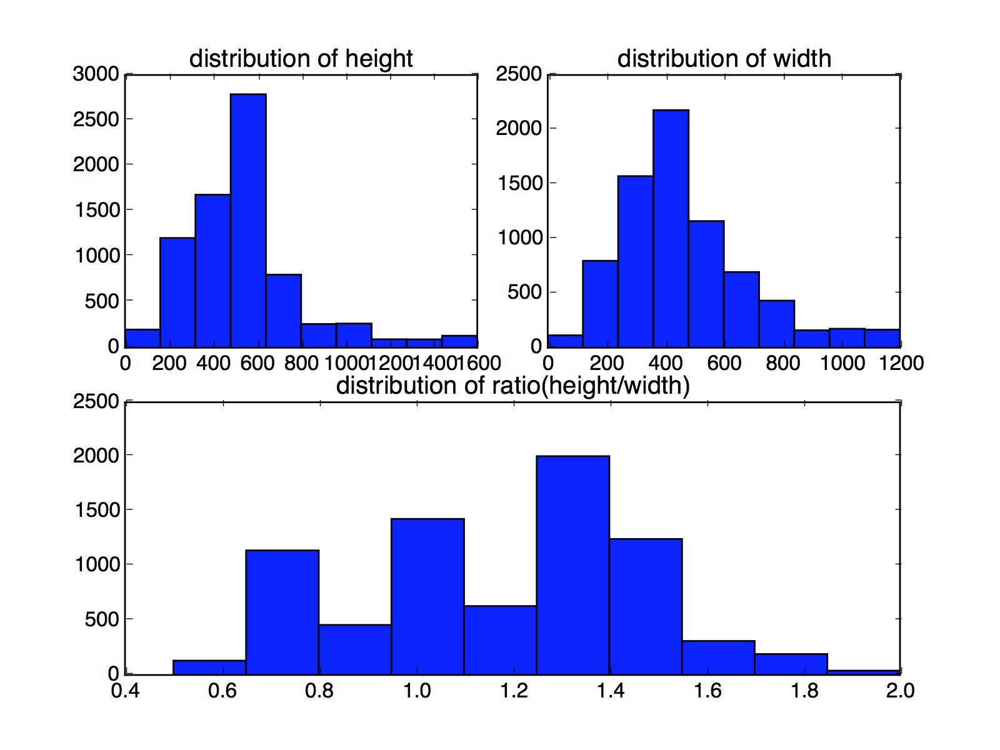

# 数据获取
从data_train.txt每行url下载图片，图片命名方式为label__linenumber.jpg

下载代码：

```shell
!/bin/bash

i=0
while read LINE
do
    let i=$i+1
    num=${LINE% *}
    url=${LINE#* }
    pic_name=$num"_"$i".jpg"
    file_name=$pic_name
    if [[ (! -f "./train_data/$file_name") || (! -s "./train_data/$file_name") ]]; then
        wget $url -O "./train_data/$file_name" -T 5 -t 1
    fi
done < 'data_train.txt'
```

## 数据统计
训练集文件包含8209个url，其中有效url有7626个，各label数量分布如下。

无效url有583个，http错误有432个，wget错误127个，文件损坏24个，包含以下几种情况。

|数量|错误类型|
|---|---|
|16|200 OK|
|14|301 Moved Permanently|
|2|302 Found|
|15|302 Moved Temporarily|
|24|400 Bad Request|
|104|403 Forbidden|
|208|404 Not Found|
|3|404 Unknown HostName!|
|1|404 Unknown virtual host|
|1|405 Not Allowed|
|1|415 Unsupported Media Type|
|5|502 Bad Gateway|
|12|503 Service Temporarily Unavailable|
|5|503 Service Unavailable|
|3|No data received.|
|14|Read error (Connection reset by peer) in headers.|
|4|Read error (Operation timed out) in headers.|
|127|wget error|

### 图片长宽分布
用analysis.py程序分析图片长宽分布，帮助统一图片长宽。

